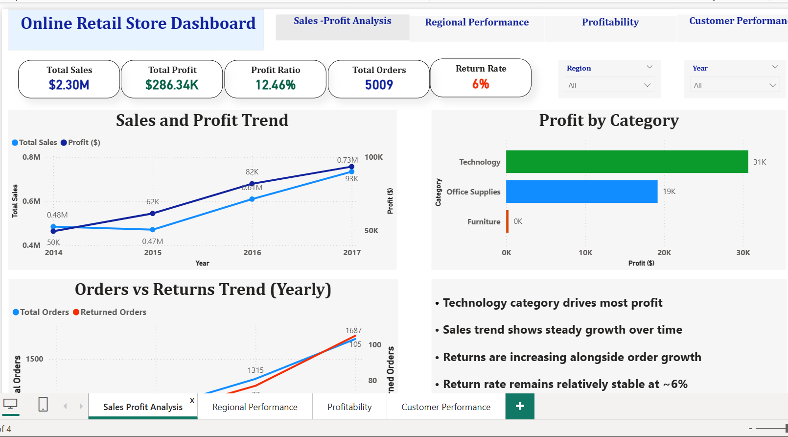
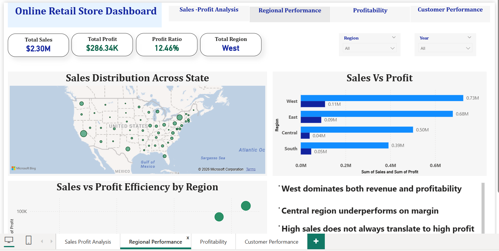
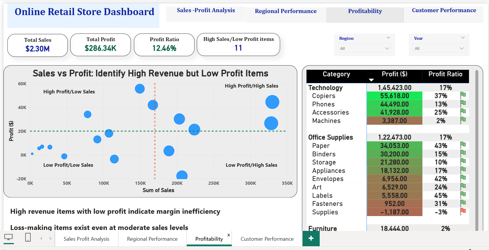
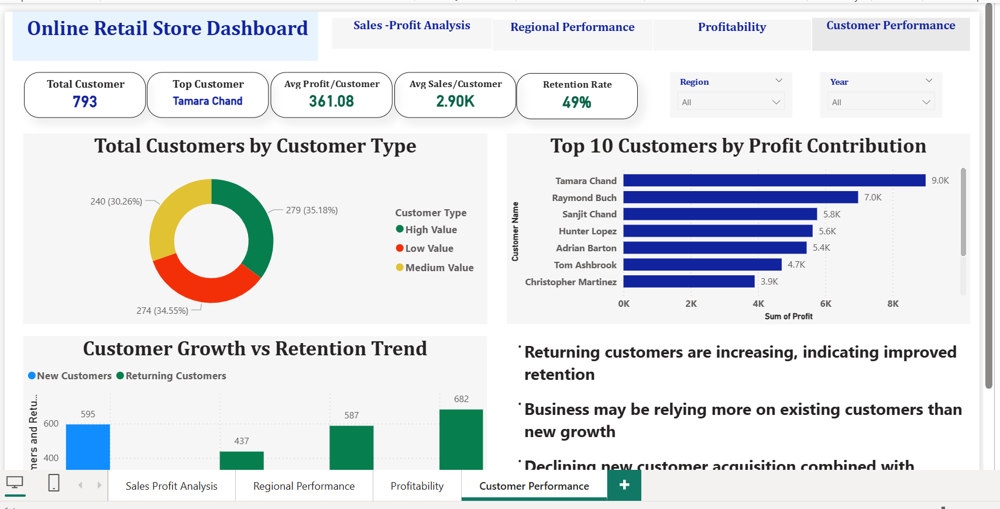

# Retail Sales Dashboard (Power BI)

## Overview
This project analyzes retail sales data to uncover insights related to revenue, profitability, customer behavior, and returns.

## Key Business Questions
- Which products generate high sales but low profit?
- Who are the most valuable customers?
- Is business growth driven by new customers or retention?
- How do returns impact overall performance?

## Key Insights
- Customer acquisition is declining over time
- Returning customers are increasing, indicating improved retention
- Business is becoming more dependent on existing customers
- Returns are increasing alongside orders, impacting profitability

## Tools Used
- Power BI
- DAX (Data Analysis Expressions)
- Data Modeling

## Dashboard Preview

## Notes
This dashboard demonstrates end-to-end data analysis including data modeling, KPI design, and business storytelling.
